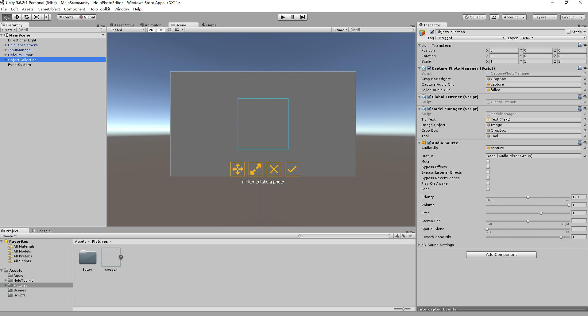
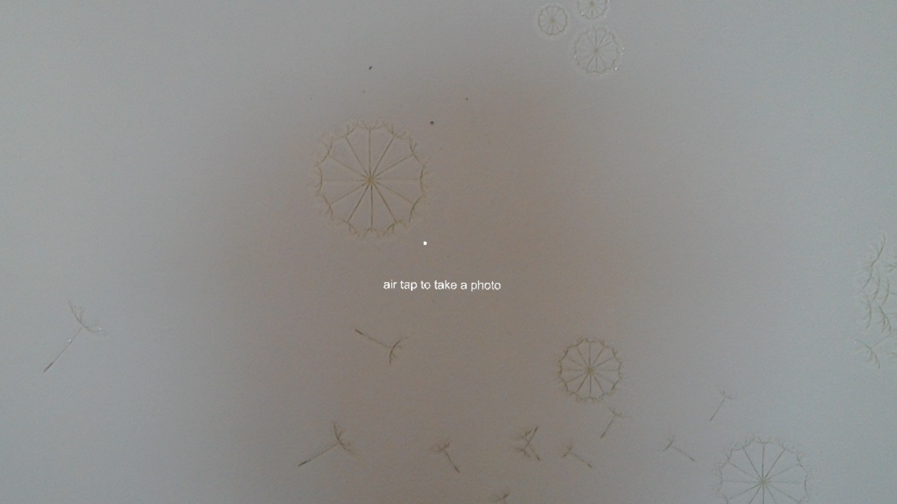
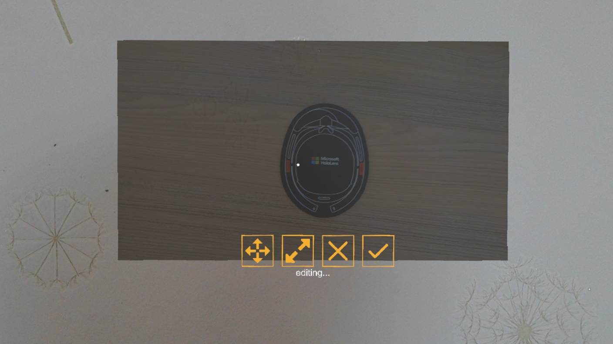
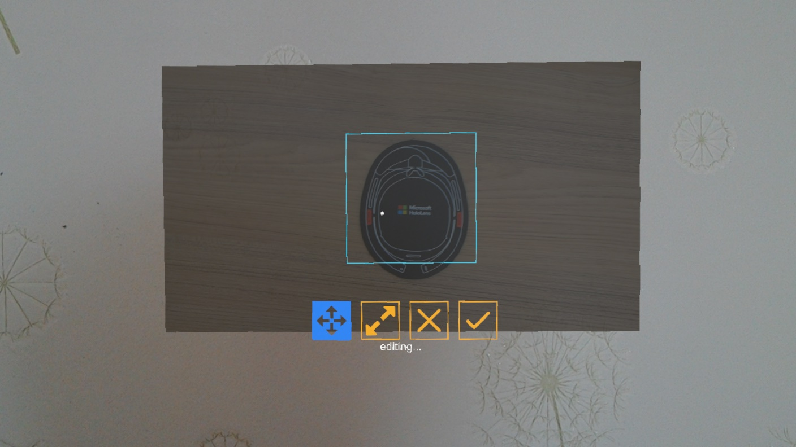
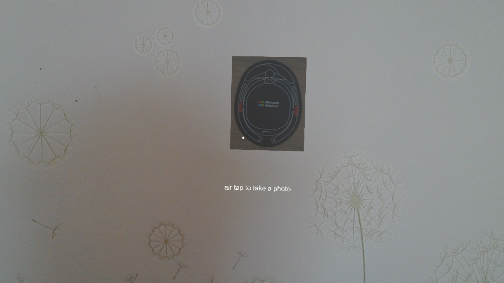

# HoloPhotoEditor #

Take and edit a photo in HoloLens.

### Dev Environment ###
*Unity*  Unity 5.6.2f1  
*HoloToolkit*    HoloToolkit-Unity-v1.5.7.0  
*Device* Hololens with Windows Holographic 10.0.14393

### Screenshots ###
1.Unity project  
  

### Usage ###
1.air tap to take a photo
  

2.after taking a photo, will see the photo and the edit menu
  

3.select the move tool, the crop box will show, you can drag the crop box to move it.
  

4.select the resize tool, you can drag the crop box to resize it.
  

5.click the done button to finish editting a photo.
